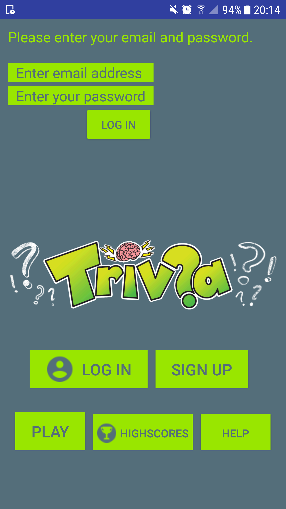
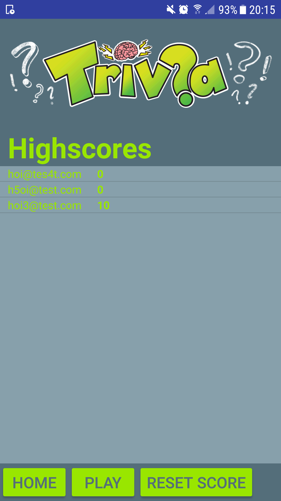
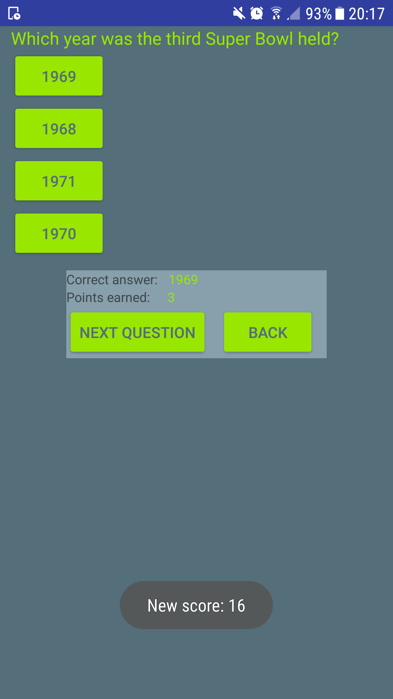
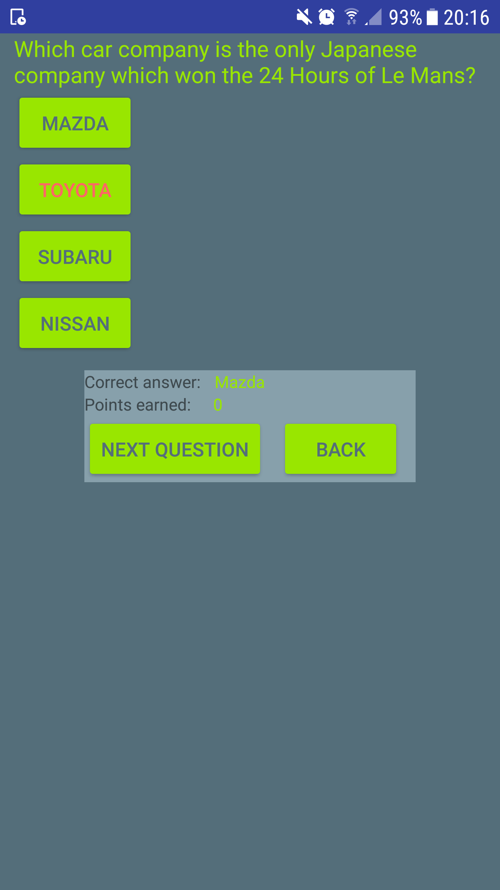
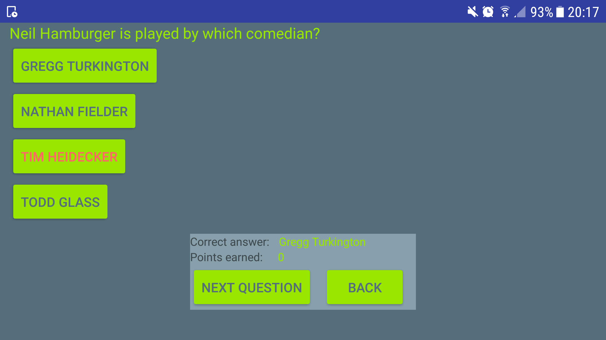

# Pset6: Your Own!
## A trivia quiz game (loads trivia questions from Open Trivia DB (https://opentdb.com)).  
Answer questions in four different subjects (Art, Celebrities, History and Sports) in three different difficulties (Easy, Medium and Hard)
and earn points. Correctly answered easy questions earns you one point each, answering a medium question earns you two points and answering
a hard question earns you three points.  
Total score is tracked and shared automatically in the highscores list.  
Sign-up using a email address and password in order to log in and beat other players in the highscores.  
Game can be played without logging in but score will not be tracked and stored.  
  
   
   
   
  

